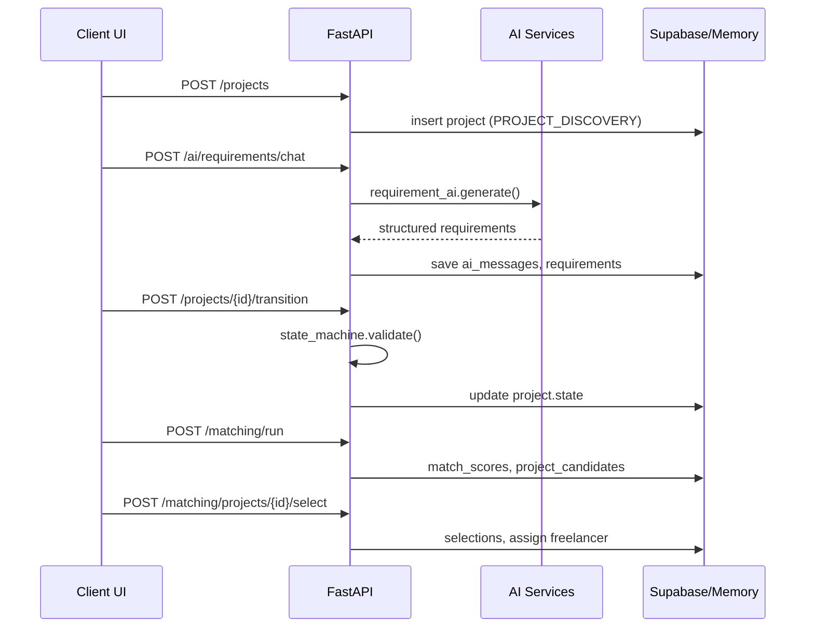

# BuildWyse Architecture

## System context

BuildWyse is a three-tier application:

1. **Presentation** — React SPA (Vite) with role-based routing
2. **Application** — FastAPI monolith exposing REST at `/api/v1`
3. **Data** — Supabase PostgreSQL + Auth, with in-memory fallback for local dev

```
                    ┌─────────────────────────────────────────┐
                    │              Vercel CDN                  │
                    │         frontend (static SPA)            │
                    └───────────────────┬─────────────────────┘
                                        │ HTTPS
                                        ▼
┌──────────────┐              ┌─────────────────────┐
│ Supabase Auth│◄────────────►│  Railway / Docker   │
│  (JWT issue) │   Bearer JWT │  FastAPI Backend    │
└──────────────┘              └──────────┬──────────┘
                                         │
              ┌──────────────────────────┼──────────────────────────┐
              │                          │                          │
              ▼                          ▼                          ▼
     ┌────────────────┐        ┌────────────────┐        ┌────────────────┐
     │ Supabase Postgres│        │   ai/ package  │        │ integrations/  │
     │ 84 tables + RLS │        │ 9 AI services  │        │ GitHub, pay, etc │
     │ pgvector        │        │ OpenAI / stub  │        │                │
     └────────────────┘        └────────────────┘        └────────────────┘
```

---

## Backend structure

```
backend/app/
├── main.py                 # FastAPI app, CORS, middleware, /health
├── api/v1/                 # Route handlers (thin controllers)
├── services/               # Business logic
├── repositories/           # Supabase client + memory store
├── core/
│   ├── config.py           # Settings from env
│   ├── security.py         # JWT decode, Role enum, DB_ROLE_MAP
│   └── state_machine.py    # Project lifecycle FSM
├── dependencies/auth.py    # get_current_user, require_admin, require_roles
├── middleware/
│   ├── audit.py            # Request context for audit logging
│   └── rate_limit.py       # 120 req/min per IP
└── schemas/                # Pydantic request/response models
```

### Design principles

- **Thin routes, fat services** — API handlers delegate to service layer
- **Server-side state machine** — lifecycle transitions never trusted from client alone
- **Repository abstraction** — same interface for Supabase PostgREST and memory store
- **Audit by default** — mutations logged via `audit_service`

---

## Frontend structure

```
frontend/src/
├── router/           # Routes, RoleRoute, ProtectedRoute, navConfig
├── pages/            # client/, freelancer/, enterprise/, admin/, auth/
├── layouts/          # AppShell, ProjectLayout
├── services/         # api.ts, projectService.ts, authService.ts, supabase.ts
├── stores/           # authStore (Zustand)
├── hooks/            # useAuth
├── components/ui/    # shadcn-style primitives
└── types/            # Shared TypeScript interfaces
```

### Role routing

| Role | Entry route |
|------|-------------|
| `CLIENT` | `/dashboard/client` |
| `FREELANCER` | `/dashboard/freelancer` |
| `ENTERPRISE_*` | `/dashboard/enterprise` |
| `ADMIN` | `/admin` |

---

## Data flow — project lifecycle



---

## Storage modes

| Mode | Trigger | Use case |
|------|---------|----------|
| **Memory** | `FORCE_MEMORY_STORE=true` or missing Supabase keys | Local demo, unit tests, CI |
| **Supabase (service role)** | `SUPABASE_SERVICE_ROLE_KEY` set | Production backend |
| **Supabase (anon only)** | Anon key without service role | Limited writes; RLS enforced |

Health endpoint reports current mode:

```json
{
  "status": "ok",
  "memory_mode": true,
  "supabase_configured": false,
  "using_service_role": false,
  "ai_mode": "stub"
}
```

---

## Cross-cutting concerns

### Authentication

1. **Production** — Supabase JWT in `Authorization: Bearer`
2. **Development** — `X-Dev-User-Id` header when `DEBUG=true`

Roles resolved from `profiles.account_type` + `user_roles` via `DB_ROLE_MAP`.

### Middleware stack

1. CORS (frontend origin)
2. AuditContextMiddleware (actor + request ID)
3. RateLimitMiddleware (120/min, excludes `/health`, `/docs`)

### External packages on sys.path

`main.py` adds repo root so `ai/` and `integrations/` import as top-level packages.

---

## Module map (backend services)

| Service | Domain |
|---------|--------|
| `project_service` | CRUD, ownership checks |
| `state_machine_service` | Lifecycle transitions |
| `matching_service` | Scoring, top-10, selection |
| `payment_service` | Orders, commission, payouts, idempotency |
| `assm_service` | After-sales vs new-project classification |
| `crms_service` | Change request workflow |
| `health_service` | Project health aggregation |
| `certificate_service` | Certificate generation (`BW-YYYYMMDD-<id>`) |
| `notification_service` | In-app notifications |
| `audit_service` | Immutable audit log writes |

---

## Related docs

- [AI_ARCHITECTURE.md](./AI_ARCHITECTURE.md)
- [SECURITY.md](./SECURITY.md)
- [DEPLOYMENT.md](./DEPLOYMENT.md)
- [../database/DATABASE.md](../database/DATABASE.md)
- [../api/API.md](../api/API.md)
